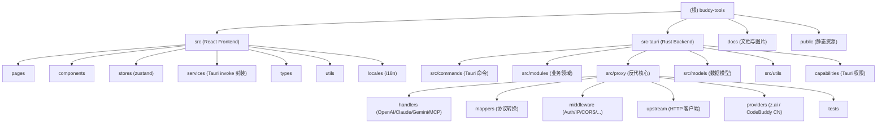

# buddy-tools — 项目导航

> 基于 CodeBuddy 协议的本地 AI 调度网关，由 Antigravity-Manager 改造而来。

## 项目愿景

`buddy-tools` 是一个跨平台桌面应用（Tauri v2 + React + Rust + Axum），核心作用是把 CodeBuddy（含 CodeBuddy CN / 腾讯 copilot）账号会话转化为标准化的 **OpenAI / Anthropic 兼容 API**，实现：

- 多账号管理（OAuth 2.0 / Token / JSON 批量导入）
- 智能调度（健康分、配额、粘性会话、熔断、限流）
- 协议转换（OpenAI ↔ Anthropic ↔ Gemini ↔ CodeBuddy）
- 模型路由与降级（按 Tier 优先级、保护高级模型）
- 安全与可观测（IP 黑白名单、请求日志、Token 用量统计）
- Headless / Docker 模式（无 GUI 后台运行）

## 架构总览

```
React UI (Vite, Tailwind, antd, zustand)        ← 桌面壳
  ↓ Tauri IPC (invoke) / HTTP (开发态走 8045)
Rust 后端 (Tauri v2 + Axum 0.7)
  ├─ commands/    Tauri 命令暴露层
  ├─ modules/     业务领域模块（账号、配额、设备指纹、OAuth、托盘…）
  ├─ proxy/       本地反代/转发服务（核心）
  │   ├─ server   AxumServer 路由
  │   ├─ handlers OpenAI / Claude / Gemini / MCP / Audio / Warmup
  │   ├─ mappers  协议转换器（双向）
  │   ├─ upstream 上游 HTTP 客户端 + 重试
  │   ├─ middleware  Auth / CORS / IP / Logging / Monitor
  │   ├─ providers   z.ai / CodeBuddy CN 等额外上游
  │   ├─ token_manager  账号池调度（健康分/Tier/限流）
  │   ├─ session_manager 会话指纹
  │   ├─ proxy_pool   出站 HTTP 代理池
  │   ├─ rate_limit / signature_cache / sticky_config / model_specs
  │   └─ cli_sync / opencode_sync / droid_sync  外部 CLI 配置同步
  ├─ models/      共享数据模型 (Account / Token / Quota / Config)
  ├─ utils/       通用工具
  └─ error.rs     统一错误类型
本地 SQLite (rusqlite, bundled)：proxy 日志 / 安全日志 / Token 统计 / User Token
外部依赖：reqwest + rquest（指纹）/ tokio / dashmap / tracing
```

## 模块结构图



## 模块索引

| 路径 | 一句话职责 | 文档 |
| --- | --- | --- |
| `src/` | React 19 前端：账号管理 / 反代设置 / 安全监控 UI | [src/CLAUDE.md](./src/CLAUDE.md) |
| `src-tauri/` | Tauri v2 + Rust 后端：桌面壳与本地服务入口 | [src-tauri/CLAUDE.md](./src-tauri/CLAUDE.md) |
| `src-tauri/src/commands/` | Tauri `#[command]` 暴露层（前端 IPC 入口） | [src-tauri/src/commands/CLAUDE.md](./src-tauri/src/commands/CLAUDE.md) |
| `src-tauri/src/modules/` | 业务领域模块（账号、配额、OAuth、托盘、设备指纹等） | [src-tauri/src/modules/CLAUDE.md](./src-tauri/src/modules/CLAUDE.md) |
| `src-tauri/src/proxy/` | Axum 反代服务：调度、协议转换、限流、熔断 | [src-tauri/src/proxy/CLAUDE.md](./src-tauri/src/proxy/CLAUDE.md) |
| `src-tauri/src/models/` | 共享数据模型 (`Account` / `Token` / `Quota` / `AppConfig`) | 见 src-tauri 文档 |
| `docs/` | 用户文档与界面截图（`codebuddy-setup.md` 等） | — |

## 技术栈

- **前端**：React 19、TypeScript 5.8、Vite 7、Tailwind CSS 3.4、antd 5、@lobehub/ui、zustand、react-router 7、i18next（12 种语言）、framer-motion、recharts
- **桌面壳**：Tauri v2.2，含 `dialog` / `fs` / `opener` / `autostart` / `updater` / `process` / `single-instance` / `window-state` 插件
- **后端**：Rust 2021，Axum 0.7、tokio、reqwest + rquest（带浏览器指纹）、rusqlite（bundled）、dashmap、parking_lot、tracing、aes-gcm、pbkdf2、sha2、machine-uid
- **构建/打包**：`npm run build`（tsc + vite）、`npm run tauri` 编排，输出 dmg / msi / deb / rpm / AppImage / updater 工件
- **包管理**：`package.json`（npm / pnpm 任选）+ Cargo

## 运行与开发

```bash
# 安装前端依赖
npm install

# 桌面调试模式（启动 Vite + Tauri）
npm run tauri dev
# 或带 RUST_LOG=debug
npm run tauri:debug

# 构建产物（前端 + 桌面）
npm run build && npm run tauri build

# 仅前端预览
npm run dev          # http://localhost:1420
npm run preview

# Headless / Docker 模式（无 GUI，仅启动反代 + Web 管理后台）
./antigravity_tools --headless
# 环境变量：ABV_API_KEY / ABV_WEB_PASSWORD / ABV_AUTH_MODE / ABV_BIND_LOCAL_ONLY
```

默认本地反代/管理后台监听端口为 `8045`（已整合，旧 19527 端口废弃）。前端开发期通过 Vite proxy 把 `/api/` 转发到 `127.0.0.1:8045`。

## 测试策略

- **后端**：`src-tauri/src/proxy/tests/` 下含 `comprehensive`、`security_ip_tests`、`security_integration_tests`、`quota_protection`、`ultra_priority_tests`、`retry_strategy_tests`、`rate_limit_404_tests`，使用 `cargo test` 执行（`#[cfg(test)] pub mod tests;`）。
- **前端**：尚未配置统一测试框架（`package.json` 无 test script）；建议后续引入 Vitest + React Testing Library。
- **集成**：通过 Headless 模式 + curl 验证 `/v1/chat/completions`、`/v1/messages` 的兼容性。

## 编码规范

- TypeScript 严格模式：`strict / noUnusedLocals / noUnusedParameters / noFallthroughCasesInSwitch`（见 `tsconfig.json`）。
- Rust 默认 `2021 edition`；公共错误统一通过 `crate::error::{AppError, AppResult}`，HTTP/网络错误自动转换。
- 日志：后端使用 `tracing` + `tracing-subscriber` + `tracing-appender`，前端通过 `log_bridge` 中继到 Debug Console。
- 持久化：账号文件落盘到平台数据目录 (`~/Library/Application Support/...`、`%APPDATA%\...`)，含 `accounts/*.json`、`gui_config.json`、SQLite DB；写入使用原子写（`atomic_write`）。
- 安全：路径校验黑名单 (`validate_path`)；管理后台支持 `auth_mode = off / strict / all_except_health / auto`；IP 黑白名单可热更新；账号文件中的 `refresh_token` 由 AES-GCM + PBKDF2 处理。

## AI 使用指引

读文档前请按以下顺序定位：

1. **要改 UI / 表单 / 路由** → `src/pages/*` + `src/components/*` + `src/stores/*`，注意通过 `services/*` 调用 Tauri 命令。
2. **要新增 Tauri 命令** → 在 `src-tauri/src/commands/` 添加 `#[tauri::command]`，并把命令名注册进 `lib.rs::run()` 的 `invoke_handler!` 列表，否则前端会拿不到。
3. **要改反代行为（路由、调度、限流、转换、上游）** → 进入 [src-tauri/src/proxy/](./src-tauri/src/proxy/CLAUDE.md)；优先阅读 `server.rs` (AppState)、`token_manager.rs`、`handlers/`、`mappers/`。
4. **要改账号 / 配额 / OAuth / 设备指纹** → 进入 [src-tauri/src/modules/](./src-tauri/src/modules/CLAUDE.md)。
5. **新增上游协议** → 在 `proxy/providers/` 加文件，再在 `proxy/handlers/` / `mappers/` 接入；同步 `config.rs` 中 `*Config` 类型与前端 `src/types/config.ts`。
6. **国际化**：所有用户可见文案需在 `src/locales/{lang}.json` 中加键值。
7. **持久化字段变更**：升级 `models/` 中结构时保持 `serde` 兼容（默认值、`#[serde(default)]`），避免破坏老 `gui_config.json`。

## 变更记录 (Changelog)

- 2026-04-29：初始化根级 CLAUDE.md（基于 v4.1.32 全仓扫描）。

