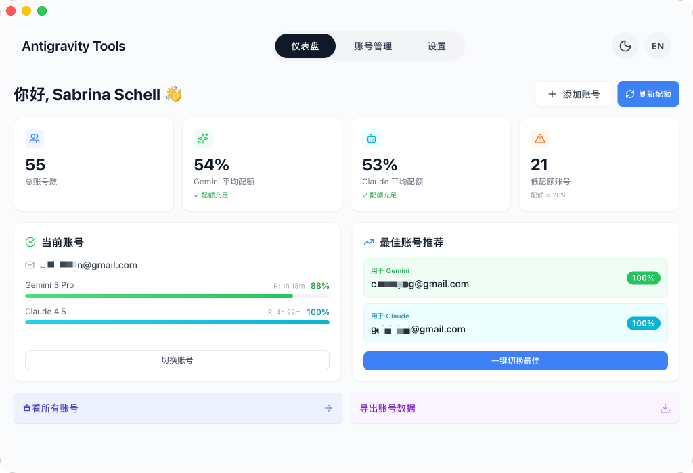
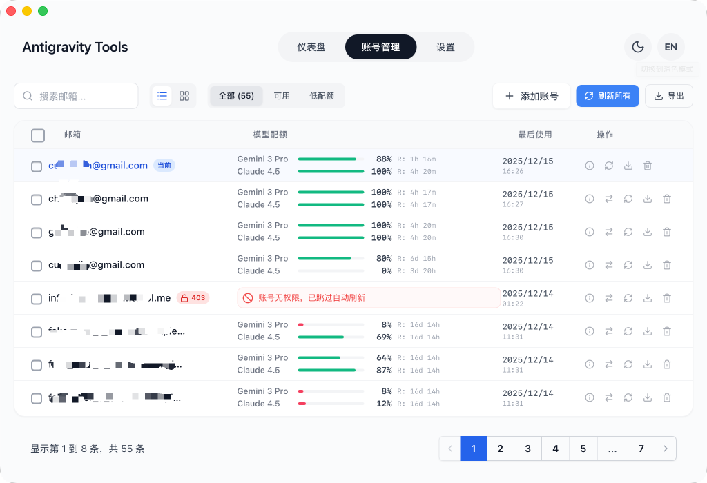
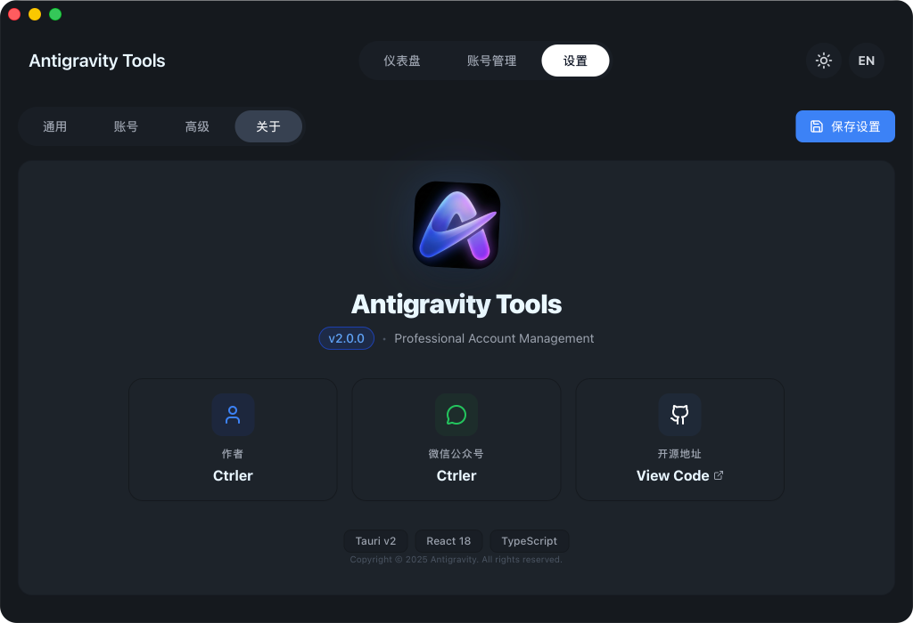
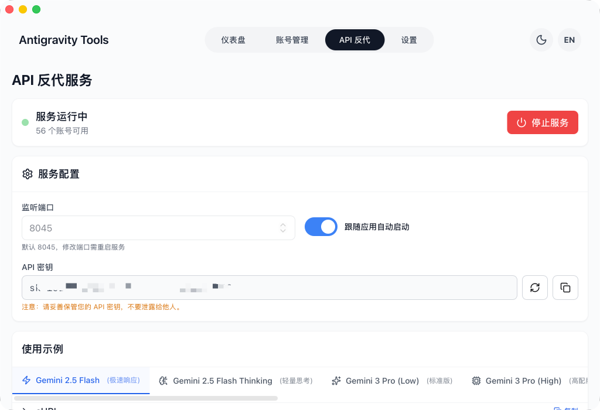
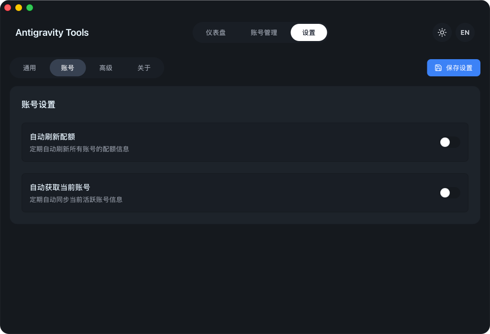
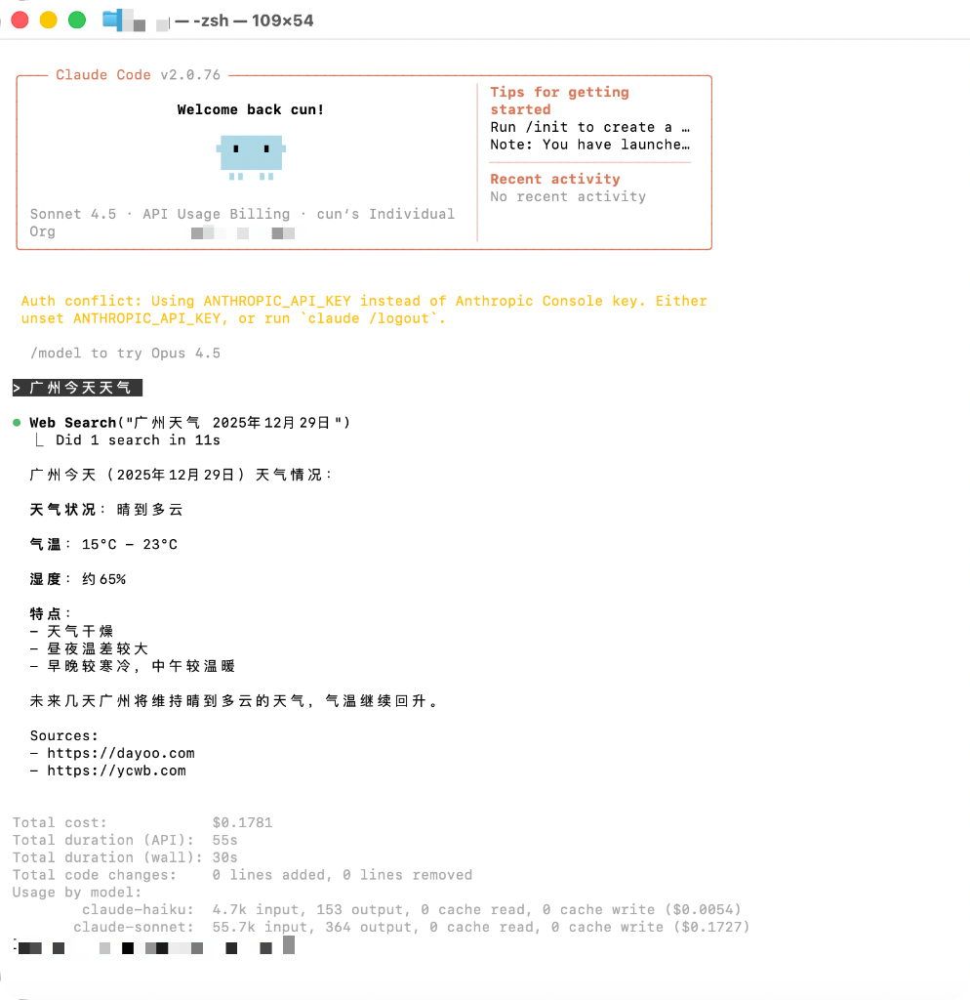
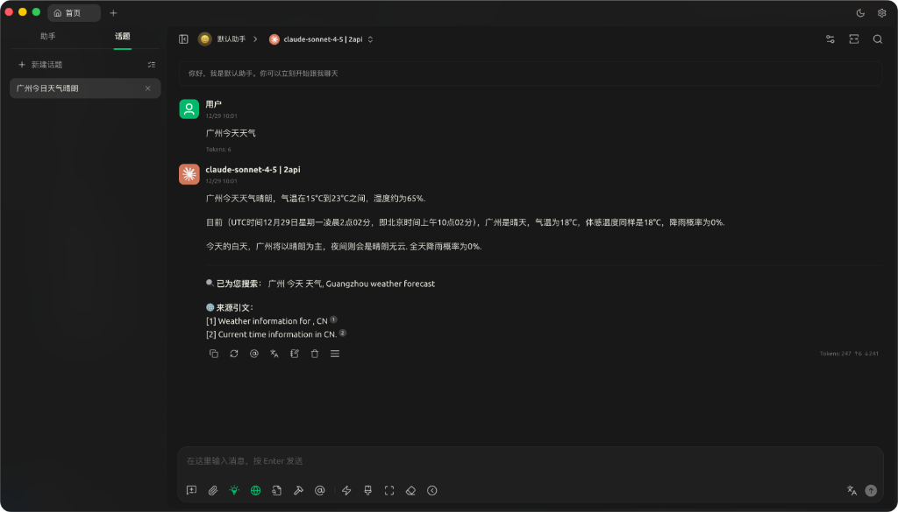
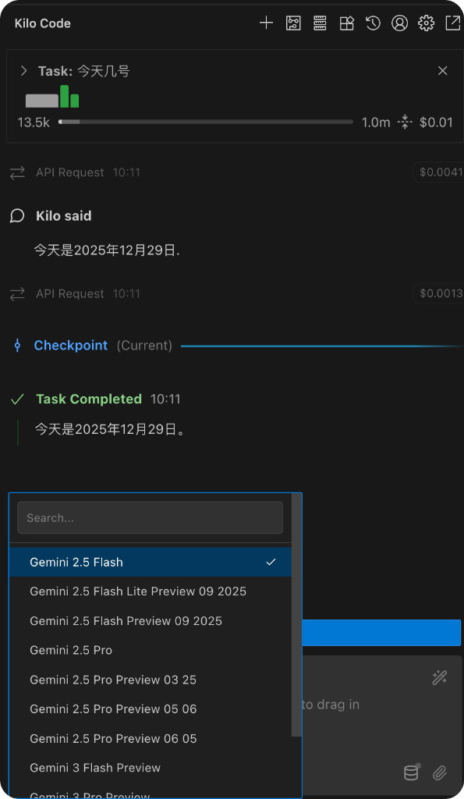
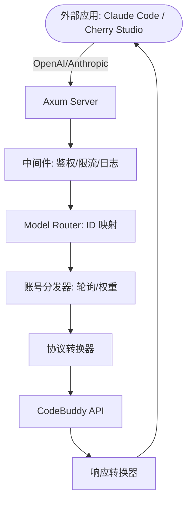

# buddy-tools

> 基于 CodeBuddy 协议的本地 AI 调度网关

<div align="center">
  

  <p>
    
    
    
    
    
  </p>

  <p>
    <a href="#核心功能">核心功能</a> •
    <a href="#界面导览">界面导览</a> •
    <a href="#技术架构">技术架构</a> •
    <a href="#快速开始">快速开始</a> •
    <a href="#接入指南">接入指南</a>
  </p>
</div>

---

**buddy-tools** 是一个专为 CodeBuddy 用户设计的桌面应用，将多账号管理、协议转换和智能请求调度融为一体，提供稳定、低延迟的**本地 AI 调度网关**。

通过本应用，您可以将 CodeBuddy Session 转化为标准化的 OpenAI / Anthropic 兼容 API 接口，无缝对接 Claude Code、Cherry Studio、Kilo Code 等主流工具。

---

## 核心功能

### 智能账号仪表盘

- 全局实时监控所有账号健康状态，包括各模型的平均剩余配额
- 根据配额冗余度实时推荐最佳账号，支持一键切换
- 直观显示当前活跃账号的配额百分比及最后同步时间

### 多账号管理

- OAuth 2.0 授权（自动/手动），支持在任意浏览器完成授权
- 支持单条 Token 录入、JSON 批量导入
- 提供列表/网格双视图，自动标注并跳过异常账号

### 协议转换与代理

- **OpenAI 格式**：`/v1/chat/completions`，兼容绝大多数 AI 应用
- **Anthropic 格式**：`/v1/messages`，支持 Claude Code CLI 全功能
- 遇到 `429 / 401` 时自动触发毫秒级重试与账号轮换

### 模型路由

- 将复杂的原始模型 ID 归类到自定义规格家族
- 支持正则表达式级模型映射
- 根据账号类型（Ultra/Pro/Free）自动优先级排序
- 自动识别后台请求并降级到轻量模型，保护高级模型配额

---

## 界面导览

| | |
| :---: | :---: |
|  <br> 仪表盘 |  <br> 账号列表 |
|  <br> 关于页面 |  <br> API 反代 |
|  <br> 系统设置 | |

### 使用案例

| | |
| :---: | :---: |
|  <br> Claude Code 联网搜索 |  <br> Cherry Studio 集成 |
|  <br> Kilo Code 接入 | |

---

## 技术架构



- **前端**：React + Tailwind CSS
- **后端**：Rust + Axum
- **桌面容器**：Tauri v2

---

## 快速开始

### 系统要求

- macOS 12+、Windows 10+、或主流 Linux 发行版
- 已有 CodeBuddy 账号

### 安装

前往 [Releases](https://github.com/DASungta/buddy-tools/releases) 下载对应系统的安装包：

- **macOS**：`.dmg`（支持 Apple Silicon & Intel）
- **Windows**：`.exe`（NSIS 安装包）
- **Linux**：`.deb` / `.rpm` / `.AppImage`

### 首次配置

1. 启动应用后，进入**账号管理**页面
2. 点击「添加账号」，按提示完成 CodeBuddy OAuth 授权
3. 授权成功后账号自动出现在列表中

---

## 接入指南

应用启动后，本地代理服务默认监听 `http://127.0.0.1:16016`。

### OpenAI 兼容接入

```
Base URL: http://127.0.0.1:16016
API Key:  任意非空字符串（如 "sk-buddy"）
```

### Anthropic 接入（Claude Code CLI）

```bash
export ANTHROPIC_BASE_URL=http://127.0.0.1:16016
export ANTHROPIC_API_KEY=sk-buddy
claude
```

详细配置参见 [docs/codebuddy-setup.md](docs/codebuddy-setup.md)。

---

## 致谢

本项目基于 **[Antigravity-Manager](https://github.com/lbjlaq/Antigravity-Manager)** 改造，感谢原作者的开源贡献。

---

## License

本项目遵循 [CC-BY-NC-SA-4.0](LICENSE) 协议——非商业使用、署名、相同方式共享。
